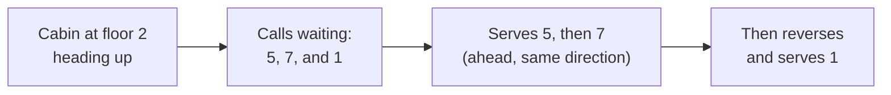

# Calls and dispatch

An elevator here behaves like a real lift rather than a one-shot platform. Press a button while the
cabin is elsewhere and the call is **remembered** and served in turn.

## Sweep order

Calls are dispatched in **sweep order**: the cabin finishes the floors ahead of it in its current
direction before reversing. It does not serve calls in the order they were pressed.

A cabin already travelling **will stop for a call that comes in ahead of it**, provided it can still
brake in time. Anything closer than that is left for the return trip, because slamming to a halt at a
floor it has already reached is not how a lift behaves.

It waits at each floor before moving on — see [dwell](#dwell-time) below.

Queued calls **survive a save**, and are dropped if their floor is removed.

## The two kinds of button

This distinction matters, and it is the one thing most likely to surprise you:

| Control | What pressing it means |
| --- | --- |
| **Elevator Controller** middle button, **Elevator Display** floor buttons, **Call Panel** arrows, **Car Panel** floor list | A real call. Joins the queue and is served in sweep order |
| **Remote Elevator Panel** up/down arrows | "Take the cabin from this floor to the next one" |

The Remote Elevator Panel's arrows are deliberately **not** queued. They only mean anything while the
cabin is standing at that panel's floor, so there is nothing to remember.

## Hall calls have a direction

The [Remote Elevator Call Panel](../reference/blocks.md#remote-elevator-call-panel) has separate up
and down buttons, and which one you press is part of the call. It fetches the cabin to that landing
*and* tells the elevator which way you then want to travel — so the elevator can pick you up on a
sweep that is already going your way, and two people heading the same direction share the trip.

The arrows light while a call is outstanding and go out when it is served or dropped.

A comparator on a call panel reports what is waiting: `0` none, `7` down, `15` up, `11` both. See
[Comparators](../reference/comparators.md).

## Car calls

Inside the cabin, the [Elevator Car Panel](../reference/blocks.md#elevator-car-panel) opens a list of
the elevator's **actual floors** rather than a fixed grid of buttons — floors are added and removed
at will, so a fixed grid could never match a real shaft.

Destinations chosen here join the same queue as landing calls, so a full trip is served in one sweep.

## Dwell time

The cabin holds each floor for a while before moving on. This is boarding time.

| Setting | Default | When it applies |
| --- | --- | --- |
| `elevatorDwellTicks` | 200 ticks (10s) | An ordinary stop |
| `bankedDwellTicks` | 300 ticks (15s) | A floor a [bank lobby panel](banks.md) sent the car to |

A banked stop is held longer because whoever called it is walking over from a lobby panel rather than
already standing at the doors.

**Close doors** on the car panel cuts either short.

## What stops a sweep

- An [emergency stop](service.md#emergency-stop) — the cabin crawls to the nearest floor and holds.
  Calls are kept, so nothing has to be pressed again.
- [Out of service](service.md#out-of-service) — the elevator stops answering entirely.
- [Independent service](service.md#independent-service) — it answers only its own car buttons, and
  ignores landing calls.
- [Fire recall](service.md#fire-recall) — it returns to a designated floor and stays there.
