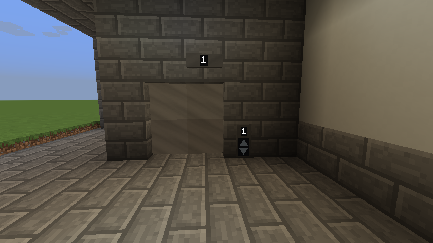
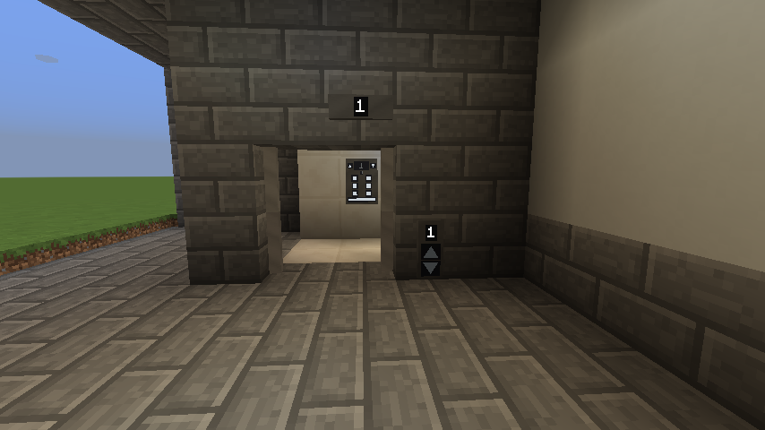

# Doors

Sliding doors for a landing, in two sizes. They are the one part of the mod with **nothing to
bind** — each doorway finds its own elevator from where it stands.

| Block | Size | Leaves |
| --- | --- | --- |
| **Elevator Door** | 2x2 | Two, meeting in the middle and retracting into either side |
| **Elevator Door (Narrow)** | 1x2 | One |

Each is placed as a single item and removed as one unit.

{ loading=lazy }

{ loading=lazy }

*A landing, closed and open. The readout above the doorway is a
[Remote Elevator Indicator](../reference/blocks.md#remote-elevator-indicator) and the buttons beside
it a [Call Panel](../reference/blocks.md#remote-elevator-call-panel) — neither is required, but this
is what a finished landing looks like.*

## Placing them

1. Craft an **Elevator Door** or **Elevator Door (Narrow)**.
2. Place it in the landing's opening. It faces you as you place it.
3. Optionally stack another doorway on top for a taller opening.

On placement it looks for an elevator landing **within 12 blocks at its own height**
(`doorLinkRange`, [configurable](../reference/configuration.md)). If it finds one, it is bound; if it
does not, it says so.

There is no bind step and no item to right-click a controller with. A door placed at a landing
belongs to that landing.

!!! failure "Not enough room for the doorway"

    A 2x2 door needs a 2x2 opening and a 1x2 door needs a 1x2 one. The block refuses to place rather
    than partially appearing.

## When they open and close

| Event | Behaviour |
| --- | --- |
| Cabin arrives | Opens |
| Landing button pressed while the cabin is already there | Opens |
| Nothing happens for `doorAutoCloseTicks` (default 12s) | Closes on its own |
| Cabin leaves | Closes immediately |
| Something living is standing in the doorway | Reopens instead of closing |
| Redstone power applied | Forced open |

The "closes immediately when the cabin leaves" rule is the important one: a landing door never stands
open onto an empty shaft.

**Redstone power forces them open** and holds them open. Treat it as an emergency override rather
than the normal way to drive a door — the elevator already opens them.

## Doors vs dwell

Two separate timers, easily confused:

- **`doorAutoCloseTicks`** (default 240 ticks / 12s) — how long the *door* stays open.
- **`elevatorDwellTicks`** (default 200 ticks / 10s) — how long the *cabin* holds the floor before
  moving on to its next call.

The cabin leaving closes the door regardless, so the door timer only matters when the cabin is
staying put.

## When a door will not open

Right-click a door and it reports what it found and what it is waiting for. This is the first thing
to check.

It will tell you, in order:

| Report | Meaning |
| --- | --- |
| *No elevator landing found within N blocks at this height* | It never bound. The nearest landing is too far, or at a different height |
| *That controller is gone, or belongs to a different elevator* | It bound once, and the controller has since been broken |
| *Door at y=… serves landing y=…* | Which landing it settled on |
| *Cabin at this landing: …* | Whether the cabin is actually here |
| *Open now: … (unseen open request: …, close: …)* | The live request state |

The usual cause is height: the door looks at **its own height**, so a door placed a block above or
below the landing finds nothing.
