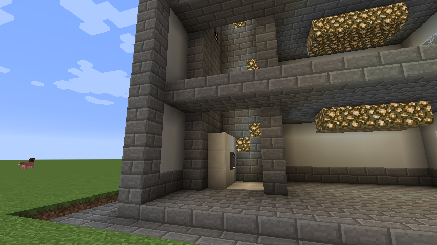

# Your first elevator

The whole mod rests on one idea: **a column of Elevator Controllers is a shaft, and each controller
in it is a floor.** The cabin is loose blocks that the elevator picks up and carries. Everything
else — displays, panels, doors — is optional control and decoration on top.

{ loading=lazy }

*Inside the shaft. The cabin is the block of quartz at the bottom, with a car panel mounted on its
back wall — everything in that space travels together.*

## What you need

- **At least 2 Elevator Controllers.** One is not an elevator; there is nowhere to go.
- **Blocks for the cabin floor.** Any solid blocks. This is the platform you stand on.

Recipes are visible in JEI if you have it installed.

## Building it

1. **Place the first Elevator Controller** where you want the elevator, at the lowest floor.

    Note which way it faces — the side with buttons on it is the front. The cabin travels in front of
    that side.

2. **Right-click a side *without* buttons.** This opens the elevator's screen.

    Set the **cabin size** and **speed** here, and give the floor a name. Sizes are in blocks and are
    capped by [configuration](../reference/configuration.md); the default limit is 11x11x11.

3. **Build the cabin floor.** Place your platform blocks **one block lower than the controller**, in
    front of the side with the buttons.

    The cabin is picked up from that space. If it is empty, the elevator has nothing to carry and
    will say so.

4. **Place the other Elevator Controllers above or below the first**, in the same column and
    **facing the same direction**.

    Facing matters — a controller turned the wrong way is a different shaft, not another floor of
    this one. There is no limit on the distance between floors.

5. **Ride it.** Right-click the **middle button** on a controller to call the cabin to that floor.
    The other two buttons move it one floor up or down.

!!! tip "It went through a block"

    That is expected. The cabin only checks blocks at floor level, because testing hundreds of blocks
    every tick would be a performance problem. Build the shaft clear if you care.

## Adding a display

The **Elevator Display** is the tall board with a button per floor.

1. Place it **on top of an Elevator Controller**.
2. Optionally stack a second Display on top of the first for a taller board.
3. Click the button for the current floor to call the cabin; click any other button to send it there.

Right-click a floor button **with a dye** to colour that floor.

## Adding doors

Craft an [Elevator Door](doors.md) and place it in the landing's opening. There is nothing to bind —
each doorway finds its own elevator, looking for a landing within 12 blocks at its own height.

## Adding panels

Every wall panel — call panel, car panel, indicator, remote display — binds the same way:

1. Hold the panel item.
2. **Right-click an Elevator Controller** of the elevator it should serve.
3. Place the panel.

The one you want inside the cabin is the [Elevator Car Panel](../reference/blocks.md#elevator-car-panel);
the one you want at a landing is the
[Remote Elevator Call Panel](../reference/blocks.md#remote-elevator-call-panel).

## Naming things

Open any controller's screen (right-click a side without buttons) to set:

- **Floor name** — for that floor only.
- **Elevator name** — for the whole elevator. Banks and bank indicators show this, so it is worth
  setting if you have more than one shaft.

## Changing an elevator later

Floors can be added and removed at any time. Break a controller and that floor is gone, and any
queued calls for it are dropped. Add one anywhere in the column and it becomes a floor immediately.

Cabin size, speed, sounds and service state all belong to the **elevator**, not to the controller you
happened to open — so an elevator cannot be fast at one floor and slow at another.

## When something is wrong

The elevator tells you rather than failing silently. Common messages:

| Message | Meaning |
| --- | --- |
| *No cabin at the current floor* | The cabin space in front of the controller is empty — build the platform |
| *Cabin space is obstructed by block …* | Something is in the way at the destination floor |
| *Invalid block … in cabin* | An unbreakable block is in the cabin and `allowUnbreakableBlocks` is off |
| *This shaft still looks like it holds a cabin at …* | A loose block was left in a landing's cabin space. A shaft holds one cabin; clear the stray blocks |
| *There are no available cabins* | Nothing to move at any floor |

Next: [Calls and dispatch](calls.md) — how the queue decides where the cabin goes.
