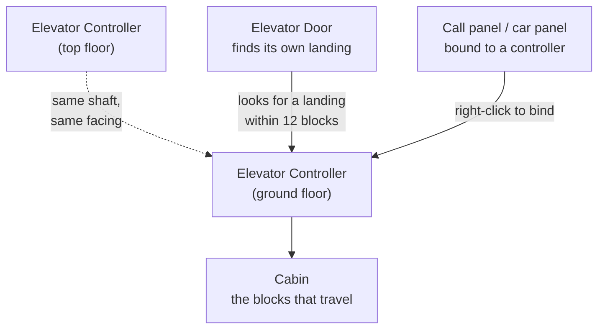

# LDMovingElevators

Elevators that physically move you, your build and anything standing on them between floors — a
cabin lifted out of the world, carried, and put back down, rather than a teleport pad.

This wiki covers **LDMovingElevators**, Mica Technologies' unofficial **Minecraft Forge 1.12** fork
of [Moving Elevators](https://github.com/SuperMartijn642/MovingElevators) by SuperMartijn642.

!!! danger "This is not the official Moving Elevators mod"

    This fork is **not affiliated with, endorsed by, or supported by SuperMartijn642**, and the
    builds published here are not the official mod. **Do not report problems with this fork
    upstream** — he did not write these changes and cannot support them.

    Full detail, and where to get the official mod instead: [This is a fork](about/fork.md).

## Where to start

-   :material-download: **[Installation](guide/installation.md)**

    What you need, where to get it, and the two library mods this depends on.

-   :material-elevator: **[Your first elevator](guide/first-elevator.md)**

    Two controllers and a platform, from nothing to a working lift.

-   :material-cube-outline: **[Blocks and items](reference/blocks.md)**

    Every block this mod adds, what it does, and how it is bound.

-   :material-tune: **[Configuration](reference/configuration.md)**

    All eleven options, their defaults and their ranges.

## What this fork adds

Upstream gives you the Elevator Controller, the Elevator Display, the Remote Elevator Panel and the
disguise system. Everything below is this fork's own work, and none of it exists in the official mod:

| Addition | What it is |
| --- | --- |
| **[Wall panels](reference/blocks.md#wall-mounted-panels)** | Remote display, indicator, landing call panel, car panel, bank lobby panel and bank indicator — flat fixtures that mount on a wall face and pop off with it |
| **[Elevator doors](guide/doors.md)** | 2x2 and 1x2 sliding doorways that find their own landing rather than being bound by hand |
| **[A real call queue](guide/calls.md)** | Calls are remembered while the cabin moves and served in sweep order, not one-shot |
| **[Elevator banks](guide/banks.md)** | Destination dispatch across several shafts, decided at the lobby before you board |
| **[Service modes](guide/service.md)** | Out of service, independent service, emergency stop and fire recall |
| **[Sound schemes](guide/appearance.md#sound)** | Two per-elevator schemes, plus cabin music |

## How an elevator is put together

Stack **Elevator Controllers** in a column, all facing the same way — each one is a floor. The
**cabin** is the loose blocks sitting in front of the bottom controller; the elevator picks them up
and carries them. Everything else — displays, panels, doors — is optional decoration and control on
top of that.

Start with [Your first elevator](guide/first-elevator.md).
