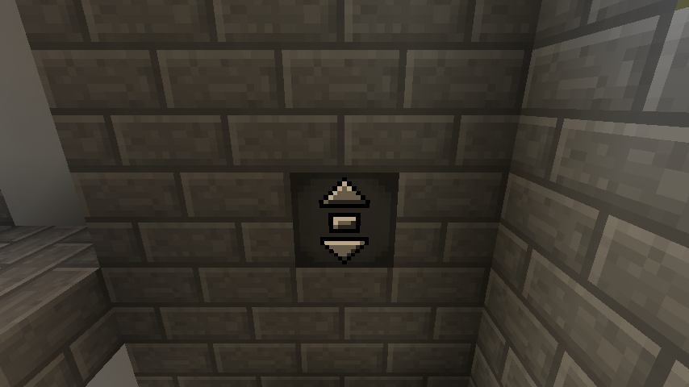
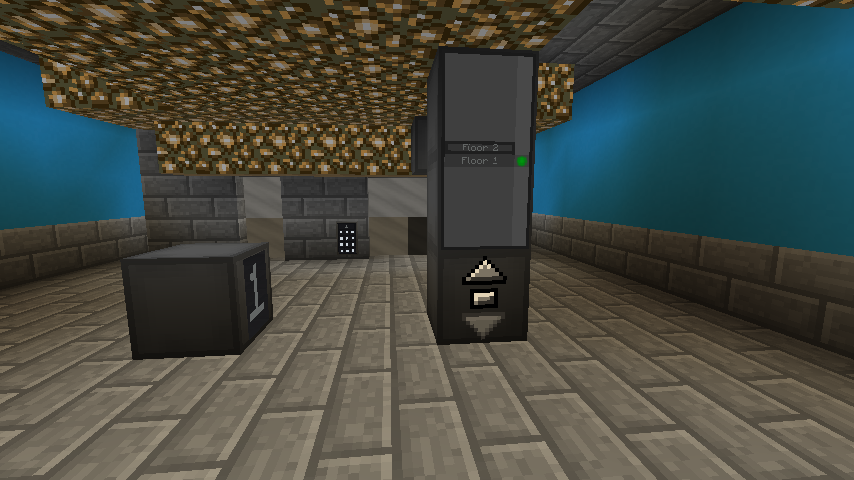
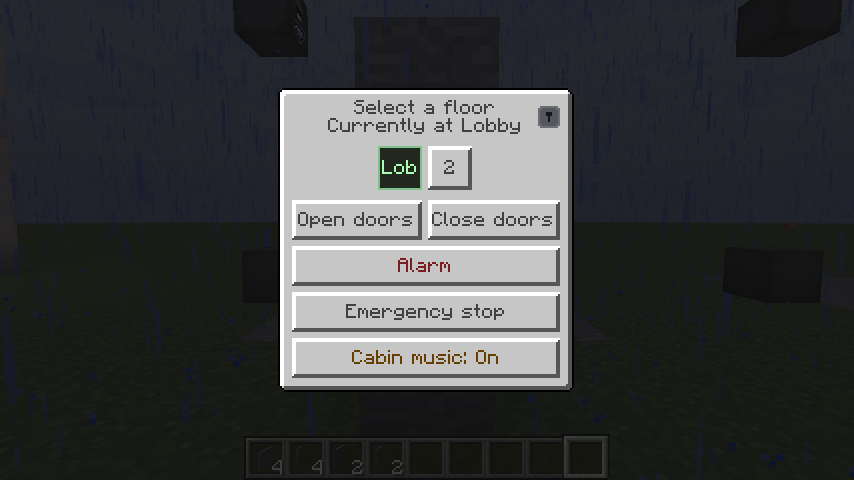
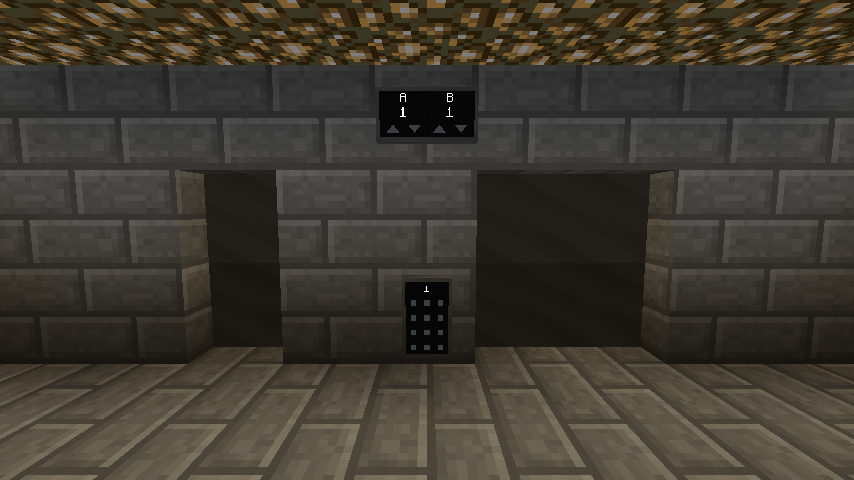
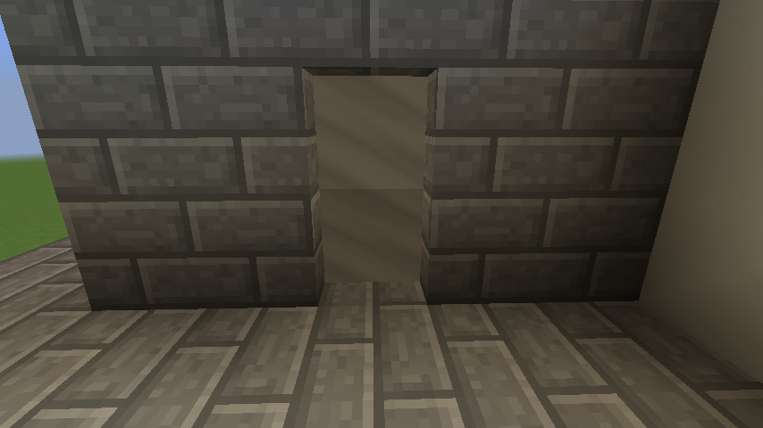

# Blocks and items

Everything this mod adds, what it does, and how it is bound. All of it lives in the **Moving
Elevators** creative tab.

## At a glance

| Block | Shape | Bound by | Origin |
| --- | --- | --- | --- |
| [Elevator Controller](#elevator-controller) | Full cube | — it *is* the elevator | Upstream |
| [Elevator Display](#elevator-display) | Full cube | Placed on a controller or remote panel | Upstream |
| [Remote Elevator Panel](#remote-elevator-panel) | Full cube | Right-click a controller | Upstream |
| [Remote Elevator Display](#remote-elevator-display) | Full cube | Right-click a controller | Fork |
| [Remote Elevator Indicator](#remote-elevator-indicator) | Wall plate | Right-click a controller | Fork |
| [Remote Elevator Call Panel](#remote-elevator-call-panel) | Wall plate | Right-click one or more controllers | Fork |
| [Elevator Car Panel](#elevator-car-panel) | Wall plate | Right-click a controller | Fork |
| [Elevator Bank Car Panel](#elevator-bank-car-panel) | Wall plate | Right-click a controller | Fork |
| [Elevator Bank Lobby Panel](#elevator-bank-lobby-panel) | Wall plate | Right-click one controller per shaft | Fork |
| [Elevator Bank Indicator](#elevator-bank-indicator) | Wall plate | Right-click one controller per shaft | Fork |
| [Elevator Door](#elevator-door) | 2x2 doorway | Nothing — finds its own landing | Fork |
| [Elevator Door (Narrow)](#elevator-door-narrow) | 1x2 doorway | Nothing — finds its own landing | Fork |
| [Elevator Alarm Linker](#elevator-alarm-linker) | Item | Sneak-click an alarm, then a controller | Fork |

---

## Elevator Controller

{ loading=lazy }

**The elevator itself.** Place controllers above each other, all facing the same way, and each one
becomes a floor of one shaft.

- Your button panel at every floor: the **middle button** calls the cabin, the other two move it one
  floor up or down.
- Right-click a side **without** buttons to open the elevator's screen — cabin size, speed, floor
  name, elevator name, sounds, out of service.
- Right-click with a block to **disguise** it as that block.
- A **redstone signal** requests the cabin; a **comparator** reads whether it is there.

The cabin is the loose blocks one block below the controller, in front of the buttoned side.

!!! note "Settings belong to the elevator, not the block"

    Speed, cabin size, sounds and service state are shared by every controller in the column. You
    cannot have a fast floor and a slow floor.

## Elevator Display

The tall board with a button per floor. Place it **on top of an Elevator Controller or a Remote
Elevator Panel**; stack a second on top of the first for a taller board.

- Shows every floor and the cabin's current position.
- Click the **current** floor's button to call the cabin; click any other to send it there.
- Right-click a floor button **with a dye** to colour that floor.
- Right-click with a block to **disguise** it.

## Remote Elevator Panel

{ loading=lazy }

*Left: a Remote Elevator Display, showing the floor and nothing else. Right: a Remote Elevator Panel
with two Elevator Displays stacked on top of it — the green dot marks the floor the cabin is on.*

The Elevator Controller's controls, placed anywhere. Bind by right-clicking a controller with it.

- Elevator Displays can be put on top, just as with the controller.
- Its **up/down arrows are not queued calls**. They mean "take the cabin from this floor to the next
  one", which only means anything while the cabin is standing there. For a real hall call, use the
  [Call Panel](#remote-elevator-call-panel).

## Remote Elevator Display

Shows which floor the elevator is at, **and nothing else** — no buttons, no redstone input.

- A **full cube**, so it can be disguised like the Controller and Display.
- While the cabin moves, it shows the floor it is nearest to.

---

## Wall-mounted panels

The rest of the blocks are **two-pixel plates on the face of the block behind them**, the way real
lift fixtures sit on a wall. They share three behaviours:

- **Directional** — the plate exists on one side only.
- They **pop off if the wall behind them is removed**.
- **No disguise option** — a two-pixel plate has nothing to disguise.

Sneak-click a placed panel to have it report what it is linked to.

### Remote Elevator Indicator

The same floor readout as the Remote Elevator Display, but as a slim plate — a hall indicator above a
lift door.

Bound the same way: right-click a controller with it, then place it.

### Remote Elevator Call Panel

A tall, narrow landing panel: floor readout at the top, **up and down call buttons** below it.

These are **real hall calls**. Pressing one fetches the cabin to that landing *and* tells the
elevator which way you then want to travel, so the call joins the queue and is served in
[sweep order](../guide/calls.md). The arrows light while a call is outstanding.

It can serve **several shafts at once**: right-click a controller in each shaft, and a press then
sends whichever of them is best placed to answer. Right-click a controller again to unlink it; sneak
and right-click the air to empty the item.

Right-clicking the readout at the top reports which controller the panel is bound to.

A comparator reads the calls waiting: `0` none, `7` down, `15` up, `11` both.

### Elevator Car Panel

{ loading=lazy }

**The panel you ride with** — mount it inside the cabin.

- Shows the current floor and direction of travel over a bank of buttons that light for the floors
  currently selected.
- Clicking it opens a **list of the elevator's actual floors** rather than mapping hits onto the
  drawn buttons — floors are added and removed at will, so a fixed grid could never match a shaft.
- Destinations chosen here join the same queue as landing calls.
- The screen also carries **Open doors**, **Close doors**, **Emergency stop**, **cabin music**, the
  [independent service](../guide/service.md#independent-service) key switch, and an **Alarm** button.

The alarm is **held down to ring** rather than fired in a burst, and rings in the cabin and at every
landing at once.

!!! info "It rides inside the cabin"

    Unlike every other panel, the car panel's position is not a world position — it is inside a
    cabin that is lifted out of the world while travelling. That is why it works while moving.

### Elevator Bank Car Panel

The car panel for a [banked](../guide/banks.md) elevator. Shows the current floor and direction, and
opens the doors or rings the alarm.

**It has no floor buttons**, because in a bank you enter your destination at the lobby panel before
you board.

### Elevator Bank Lobby Panel

A destination-dispatch station bound to **several** elevators at once. You pick where you are going
before boarding, and the panel decides which car collects you.

There is no up/down call on it, deliberately: choosing a destination tells the bank the whole trip,
which is the only way it can send a car that is already going that way.

Bind by right-clicking **one controller in each shaft** — the panel finds the rest of that shaft's
floors, and its own landing, by itself. The item **keeps its links after you place a panel**, so one
lobby panel per floor takes no extra work. Right-click a placed, configured panel with another panel
item to **copy its whole bank** onto that item.

Shafts may serve different floors, but they may not disagree about one: two **named** floors at the
same height with different names is refused, and so is the same name appearing at two heights.
Unnamed floors are not compared at all.

Full detail: [Elevator banks](../guide/banks.md).

### Elevator Bank Indicator

{ loading=lazy }

*A two-car bank: the indicator gives each elevator a column with its name, its floor and its
direction; the panel below it is where you enter a destination.*

**One readout for a whole bank** instead of one per shaft: a column per elevator showing that
elevator's name, the floor its cabin is at, and which way it is going. A landing needs one plate
rather than one per shaft.

Link it to one controller in each shaft, exactly like the lobby panel. Right-click the placed block
to see what it is linked to.

The plate **widens itself to fit** — two columns up to six, overhanging its own block at the wider
end. Past six, the extra elevators stay linked and working but have no column of their own, and the
block says so.

---

## Elevator Door

A **2x2 sliding doorway** whose leaves meet in the middle and retract into either side.

Placed as one item, removed as one unit, and it **finds its own elevator** — there is nothing to
bind. It looks for a landing within 12 blocks at its own height.

Opens when the cabin arrives, closes on its own after a dwell, closes immediately if the cabin
leaves, and reopens on anything living standing in the doorway. **Redstone power forces it open.**

Stack them for a taller doorway. Right-click one to have it report what it found and what it is
waiting for.

Full detail: [Doors](../guide/doors.md).

## Elevator Door (Narrow)

{ loading=lazy }

The same block in **1x2** with a single leaf. Identical behaviour.

---

## Elevator Alarm Linker

**An item, not a block.** Ties an elevator to a [City Super Mod](../guide/installation.md#optional-integration-city-super-mod)
fire alarm panel, so the car returns to a chosen floor whenever that alarm sounds.

1. **Sneak** and right-click a fire alarm panel.
2. Right-click the **Elevator Controller at the floor the car should recall to**.

CSM's own fire alarm linker works for the second step too. Sneak-right-click the air to forget the
held panel.

Without City Super Mod installed there is nothing to link to, and the item does nothing.

Full detail: [Fire recall](../guide/service.md#fire-recall).
